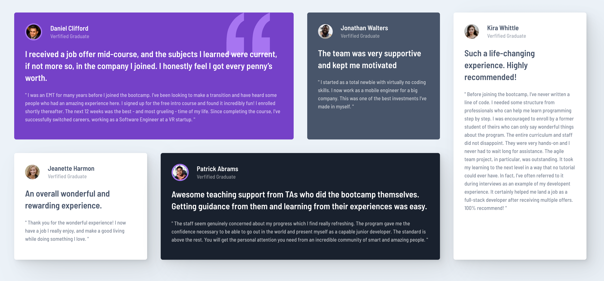

# Frontend Mentor - Testimonials grid section solution

This is my solution to the [Testimonials grid section challenge on Frontend Mentor](https://www.frontendmentor.io/challenges/testimonials-grid-section-Nnw6J7Un7). Frontend Mentor challenges help you improve your coding skills by building realistic projects. 

## Table of contents

- [Overview](#overview)
  - [The challenge](#the-challenge)
  - [Screenshot](#screenshot)
  - [Links](#links)
- [My process](#my-process)
  - [Built with](#built-with)
- [Author](#author)

## Overview

### The challenge

Users should be able to:

- View the optimal layout for the site depending on their device's screen size

### Screenshots

### Links

- Solution URL: [https://github.com/markusbotsch/fem-testimonial-grid](https://github.com/markusbotsch/fem-testimonial-grid)
- Live URL: [https://markusbotsch-fem-testimonials-grid.netlify.app](https://markusbotsch-fem-testimonials-grid.netlify.app)

## My process

### Built with

- [React](https://reactjs.org/) - JS library
- CSS custom properties
- Flexbox
- CSS Grid
- Mobile-first workflow

## Author

- Website - [Markus Botsch](https://www.markusbotsch.com)
- Frontend Mentor - [@markusbotsch](https://www.frontendmentor.io/profile/markusbotsch)
- Twitter - [@markusbotsch](https://www.twitter.com/markusbotsch)

